<!-- Use these horrible HTML tag attributes because Markdown only supports limited HTML/CSS -->

  

## Plant genomes: from data to discovery EBI Virtual Course

# Session 1: The Germinate Web Interface and Working with Germplasm
# Part 1 - Introduction

This tutorial will guide you through the main components of the Germinate interface. All Germinate databases have the same web based user interface so if you become familiar with one, you are familiar with them all. This is an important benefit of Germinate in that its a common platform which has use across a wide variety of crops, providing consisent user interfaces for all.

We can start with watching this short video on the Germinate interface which will give you some background on how the system is organised. Click on the image below to view.

Now thats finished lets look in more detail about the material the video covered and see the features that Germinate offers for working with germplasm. We are going to use the Germinate Demo database and have a go at answering some questions.

### Go to [https://germinate.hutton.ac.uk/demo](https://germinate.hutton.ac.uk/demo) and try answering the questions below.

## Tasks:

1. 

Identify the genetic maps page. How many maps are there?
Answer: 1

2. 

How many genetic markers are on this map?
Answer: There are 5,000 markers on this map.

3. 

How many traits are defined in this database?
Answer: There are 56 traits defined in this database.

4. 

Go to the 'Data Statistics' page. Which country has the largest number of accessions collected there? and how many are there?
Answer: China and we have 304 accessions collected there in our test database.

5. 

Try changing the colour scheme to 'Dark Mode' and changing the interface language - do you remember where those things are?
Answer: They are in the settings bar at the top right hand side of the screen.

 

# Part 2 - Working with Germplasm

This tutorial will show you how to work with germplasm entries held in Germinate.

All data that Germinate holds is related back to the underlying germplasm (this is one of our core concepts and the foundataion for tools like Germinate) and so being able to effectively work with germplasm and utislise the tools that we offer is important.

### Go to [https://germinate.hutton.ac.uk/demo](https://germinate.hutton.ac.uk/demo) then click on 'Data' then 'Germplasm' from the left hand side menu.

## Before we start

### Getting help 

If you're ever stuck while using Germinate, use the help button which can alwas be found in the top right hand side of the Germinate interface. Try clicking on it now to get information on the 'Germplasm' page.

This help provides more information about the current page or functionality. This feature will explain the interface components or the content of the page in more detail. If they help icon is greyed out then additional help information is not available for this page. This screenshot shows the type of information that we hold for the germplasm page in Germinate.

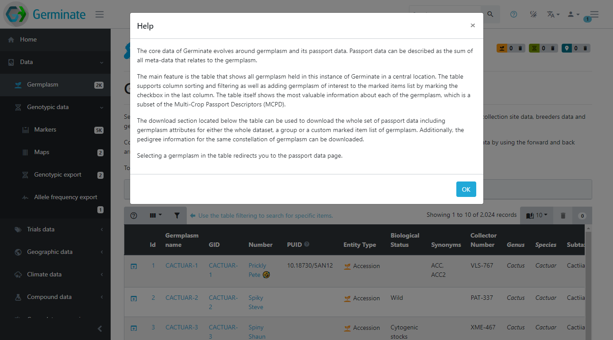

## So lets get started!

We will use the Germinate demo database in this instance (you should have it bookmarked but if not you can [access it here](https://germinate.hutton.ac.uk/demo)). The demo database contains real data but we have anonymised it and assigned a fictional plant species, the [Cactuar](https://en.wikipedia.org/wiki/Cactuar). We have done this because all projects are different and Germinate supports more data types than projects generally contain. The demo database has all data types we support along with all features available to users to try out in a safe environment.

***Remember you can't break anything so use the Demo database to play about with features and don't worry about anything (except climate change and shrinkflation in chocolate biscuits).***

Once you are at [https://ics.hutton.ac.uk/germinate-demo](https://germinate.hutton.ac.uk/demo) click on the 'Data' menu item on the left hand menu then on the 'Germplasm' menu item.

You should now see something like this:

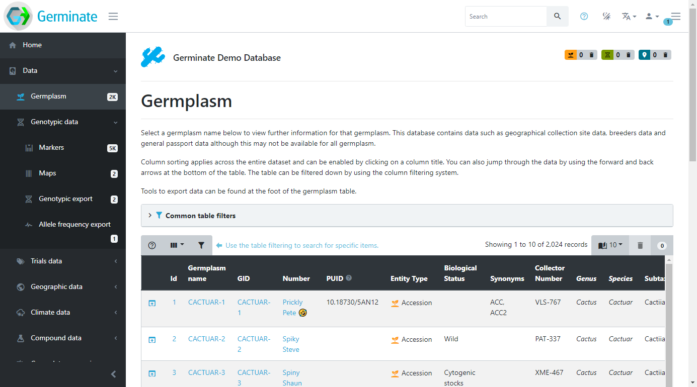

This page shows all the germplasm (accession or samples) that Germinate contains for the chosen database. This is where you can come to browse the accessions and search for germplasm that may be of interest.

## Showing and hiding columns 

Tables within Germinate show **lots** of information and this can often be overwhelming. Sometimes, you will only be interested in a specific part of this information and hiding table columns is one way to allow you to focus better. Use the dropdown button in the top left of any table to select the columns you wish to show or hide. These settings are remembered for your session, so they will be remembered *until* you close your browser. If you make a change it only applies to your session so nobody else will see your changes. 

This example shows how you add or remove columns from the Germinate germplasm page. Click on the show/hide columns option within the table options. This option can be found at the top left hand side of the table beside help and filter options.

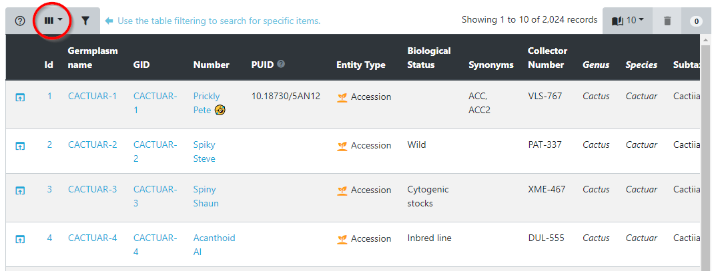

Now that you have selected this you can choose which columns to show and hide. Its easy, just click on them to toggle on and off. If you accidentally turn off something you want to see just go back and enable it again. Look at this screenshot, notice how the columns are different? Try adding and removing some columns yourself.

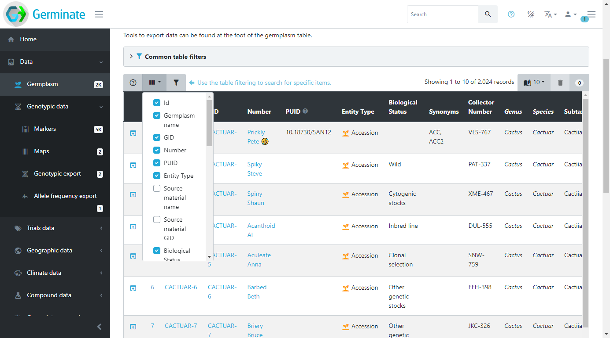

## Selecting how many entries to show 

Another way to change how data is displayed in tables is changing the number of rows that are shown at a time. By default, Germinate only shows a small number of rows the reduce the amount of scrolling required to take in all the information. To show more rows per page, select a different value from the dropdown menu in the top right of the table. The display will refresh and now show the requested number of rows. Have a play about with this and see which looks best on your monitor screen. Like toggling table columns on or off this setting remains at the number you set until you close your browser.

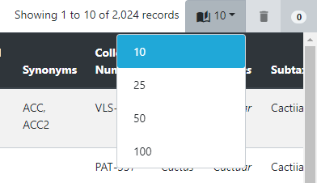

## Sorting and filtering the germplasm table 

All tables within Germinate can be sorted or filtered by any of the columns you see. Sorting happens by clicking on a table header and another click on the same column inverts the sorting direction. This image shows the table header. If you look at the diamond icon next to Germplasm name in the table header you will see how the table is sorted. If the light coloured half is on the top it means the column is sorted alphabetically and on the lower (like here) its reverse alphabetical ordering.  Try clicking on some of the table headers to see what effect the sorting has on the table. The table sorting sorts data across the **entire database** and not just the lines that are in the current table page.

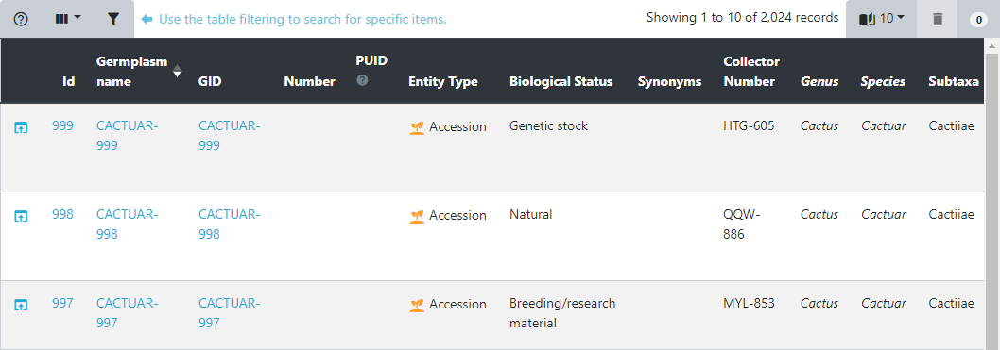

Filtering is a very useful tool when searching for specific data points. In this example, we are looking at the germplasm table. The filtering dialog is opened by clicking the filter button in the top left of the table. 

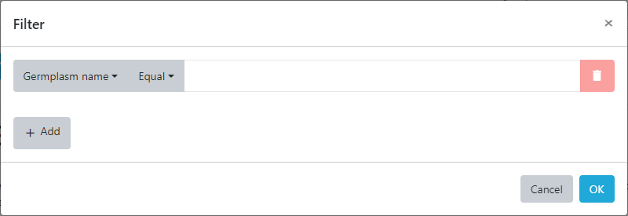

Here, search criteria for each column can be defined and combined allowing simple searches as well as complex queries. To search for germplasm whose name matches a specific text pattern select the ***Germplasm name*** column from the dropdown and then enter the text you want to search for. Be sure to change the match type from ***Equal*** to ***Contains*** then enter the following into the search box.

>cactuar-9%

Now the ***%*** might appear confusing but the ***%*** sign is the standard wildcard for SQL (database) queries and means that the query will look for everything starting with ***cactuar-9*** then anything after it. It can be thought of like the ***\**** character in the Windows operating system.

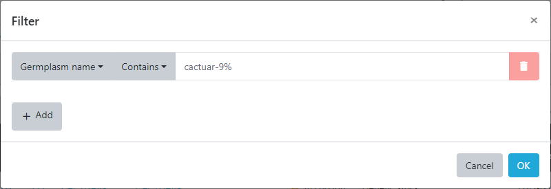

This filter can be combined with a search for germplasm from a specific country resulting in only germplasm with the combination of species and country of origin to be displayed in the resulting table. This example shows us building up a layered query by including only germplasm with the pattern ***cactuar-9%*** from ***Country*** that is equal to ***Brazil*** and finally only those matches where the collection site for the accession was ***greater than 500m***. 

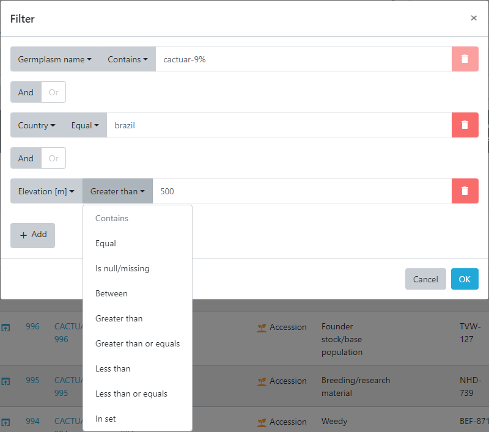

Now press ***OK*** and the database returns 4 records that match these criteria.

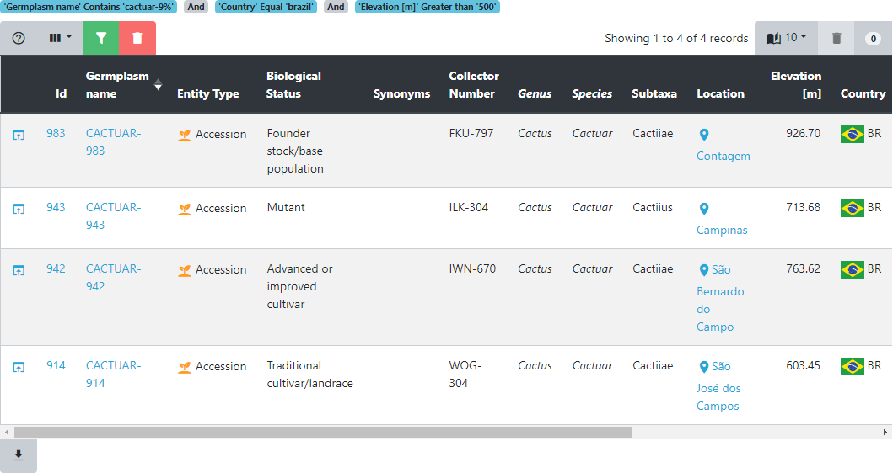

If we click on the ***Germplasm name*** we get a page that shows all the information we know about that particular entry. We will cover this in more detail later in this training but have a look and see what types of data Germinate holds for entry ***CACTUAR-914***.

The passport page of a germplasm is where all information available for this germplasm is aggregated in a single location. Meta-data, pedigrees, location information, images, and data availability are all easily accessible from here. 

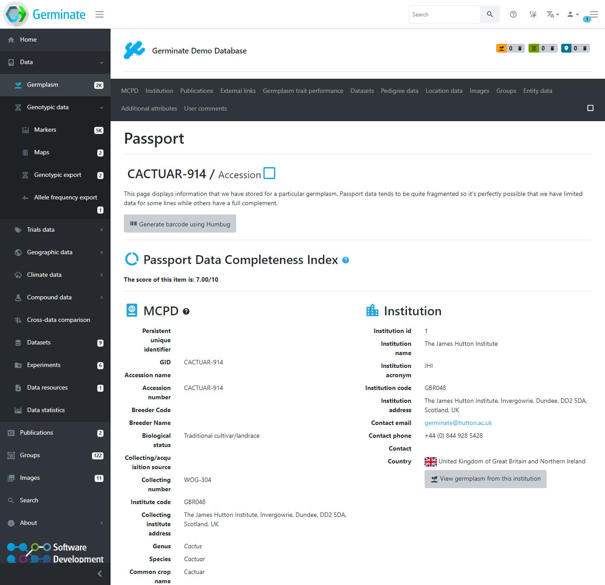

## Tasks:

1. 

Go to the main Germplasm list page and try showing and hiding columns.
You can navigate to the page by clicking <a href="https://germinate.hutton.ac.uk/demo/#/data/germplasm">here</a> then selecting table options from the top left hand side of the germplasm table.

2. 

Using the germplasm table filtering, search for germplasm collected in Morocco.
If you want to try using the wildcard <strong>%</strong> try changing the search from <strong>Equal</strong> to <strong>Contains</strong> and your search term to mo<strong>%</strong>. Do you get the same results? Why are there other results in the search now?

3. 

Navigate to the passport page for the line whose country of collection is <strong>Kenya</strong> where the elevation is above <strong>1500m</strong> and the accession biological status is equal to <strong>Natural</strong>. What datasets does this line appear in?
There are 4 datasets that this line appears in. Datasets "Sample Phenotype Data",  "Sample Compound Data", "Sample Genotype Data Subset 2." and "Default pedigree dataset."

## Now are are ready to learn about <a href="session2.html">'Session 2: Experiments, Datasets, other Data Resources and Groups'</a>

This training is released under an CC BY-NC-SA 4.0 licence.