<!-- Use these horrible HTML tag attributes because Markdown only supports limited HTML/CSS -->

  

## Plant genomes: from data to discovery EBI Virtual Course

# Session 3: Genotypic and Phenotypic Data
### Go to [https://germinate.hutton.ac.uk/demo](https://germinate.hutton.ac.uk/demo) to follow along with this material.

Germinate stores genotypic data in the form of an allele call for a specific locus. Genetic and physical maps are stored alongside this data and can be explored independently by selecting the **maps** item in the main menu. Let's locate that and click on it to see what maps we have in the Germinate training database.

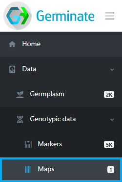

The table displayed shows all maps stored in Germinate along with the number of markers thathave positions on them. Germinate does not care if the maps are genetic or physical as long as the marker indexing system is consistent and makes sense across the entire map.

Click on the **All markers** map.

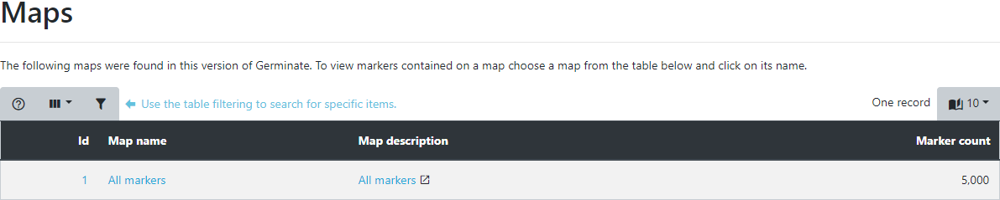

Upon selection, all markers and their positions are displayed both in tabular form as well as in a density histogram per chromosome or linkage group. If you want more information on a specific marker you can click on its name. You will then be able to see which other maps the marker is assigned to and all **genotypic datasets** that contain a marker with this name in Germinate.

The **density histogram** shows the distribution of markers across a chromosome. The height of the bar indicates the number of markers which are within that location. We use 500 bins across the chromsome.

> For markers with an unknown position we usually assign them to chromosome or linkage group 'U' which allows us to distinguish them easily in Germinate or when using graphical genotyping tools such as [Flapjack](https://ics.hutton.ac.uk/flapjack).

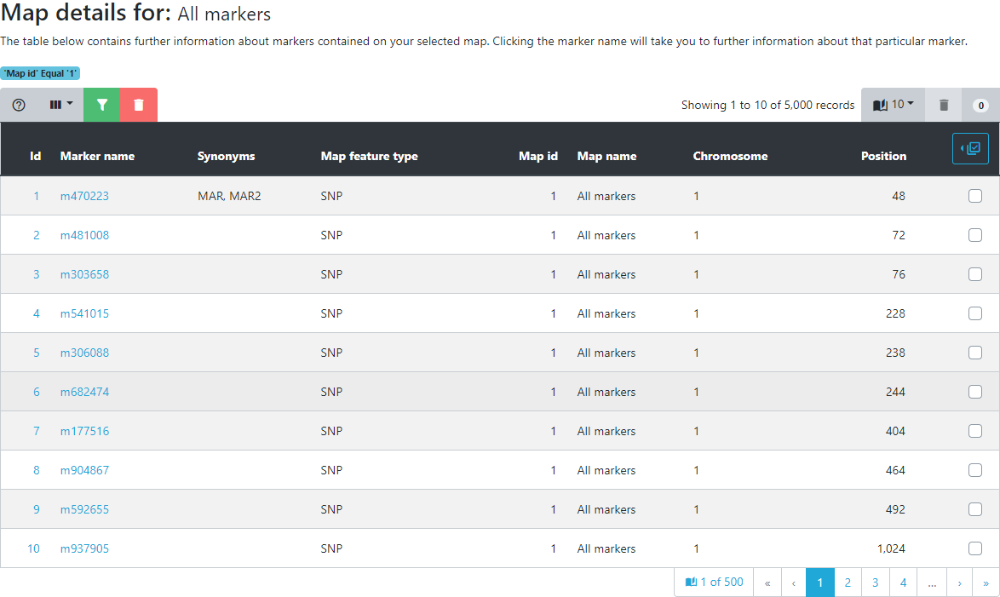

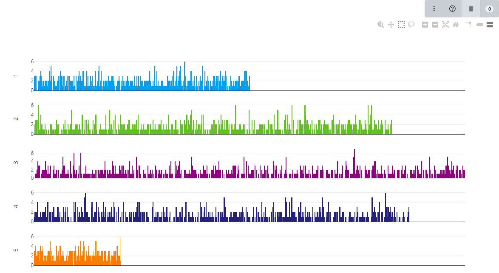

> Groupings of markers can be created by filtering the table or selection within the density chart. These are then available during the genotypic data export like when we created groups in the previous section.

### Exporting data

Now we will work on exporting genotypic data from Germinate. To start go to the left hand menu then select the **Data**->**Genotypic Data**->**Genotypic export** option as shown below.

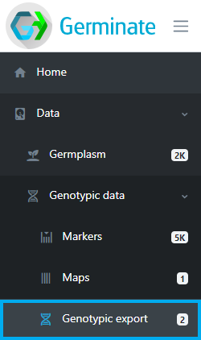

To export genotypic data, select a **single** or **multiple** dataset(s) from the table on the genotypic export page. Select datasets by clicking on the blue lefthand column and a tick will appear for datasets that will be used in the export process. While most exports of data will be from a single dataset there are occasions where data may be split across datasets and Germinate is able to merge genotypic data based on the marker names across datasets.

Select your datasets (in this case both of them) then click on **Next**.

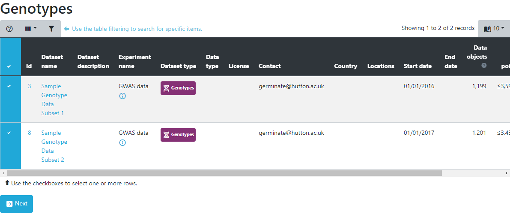

On the next page, data can either be exported as a whole dataset or by sub-setting using groups or marked items covered in an earlier tutorial. Next, a map is chosen from the dropdown menu. Germinate supports multiple export formats for genotypic data. By default, the export will always include a flat tab-delimited file and optionally the same data in Flapjack or Hapmap format. 

You can easily switch between options by clicking the appropriate ones here. We would encourage you to have a play about with each of them to see the files that are returned. 

Make sure the export to Flapjack option is selected for this tutorial then click on **'Export'**

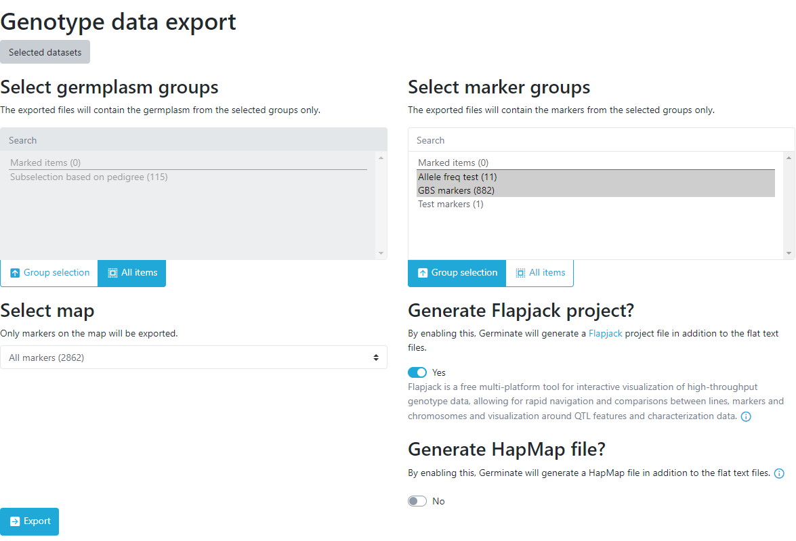

Genotypic data is exported **asynchronously** meaning you can keep using Germinate while your requested data is exported. Germinate will let you know when your download is ready for download and you can continue to explore the genotypic data while the export is being processed by the Germinate server. You will see the download status by clicking the three line icon at the top right hand side of the Germinate interface beside the user options.

> The asynchonous downloads can be toggled by pressing the three lined icon to toggle.

The following images show you what this process will look like. Note how in the left hand image it shows the export job as **Running** and in the right it has completed and is offering **Download** options along with information on when the job was run and the resulting file size.

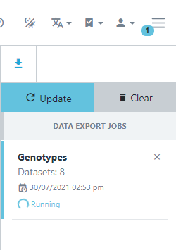 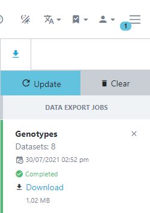

In this case we exported Flapjack format files so click on **Download** then extract the resulting zipped folder on your computer and double click the Flapjack file to automatically load the data into Flapjack.

## Tasks:

1. 

Identify the maps page. How many maps are there?
To get to the maps page go to the left hand side Germinate menu then follow Data->Genotypic Data->Maps Answer: There is just one map defined in the Germinate training database.

2. 

How big is the largest map?
Answer: There are 5000 markers on the map.

3. 

What's the maximum position on chromosome 7?
Answer: 94,967

4. 

Go to the Genotypic data->Genotypic export page then select the dataset with ID3. Why do you think there are only 3k markers reported in the map selection box here while we saw that the map contains 5,000 markers in question 2 above?  
Answer: Germinate looks at the genotypic data and only exports data for markers that have data recorded against them. A map can contain markers that are not in a dataset.

5. 

Export data for one of the datasets then download the zip file and have a look at the 3 files that it contains.
Remember if you select to download in Flapjack and/or HapMap then additional files will be creted and included in your download.

# Session 6: Phenotypic data
### Use your Germinate bookmark from the previous session or to go [https://germinate.hutton.ac.uk/demo](https://germinate.hutton.ac.uk/demo) to follow along with this material.

This tutorial will show you how to explore, visualize and export phenotypic trials data. We can access traits by clicking on the **Traits** option in the left hand side menu in Germinate. **Traits** is found under **Data** -> **Trials Data**.

## Traits

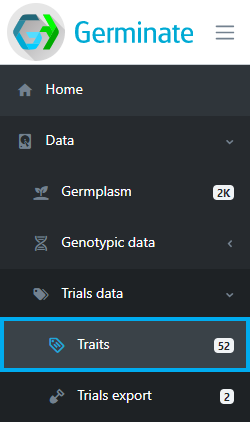

The traits page shows all traits that have been scored across all trials within Germinate, their data types, synonyms, units and how many individual data points have been recorded.

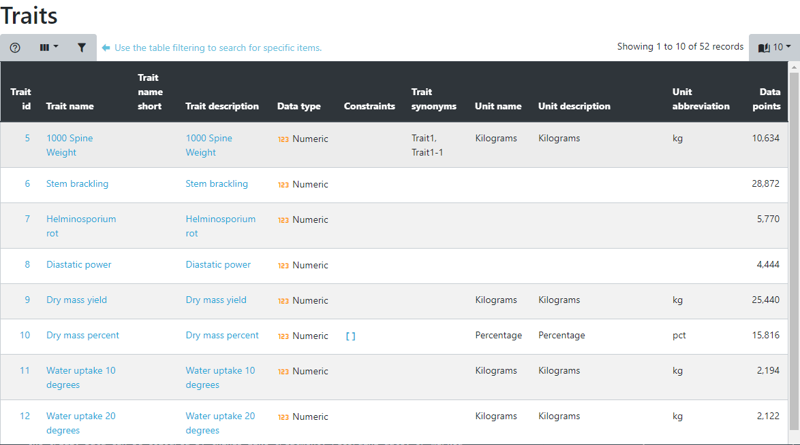

Selecting a trait by clicking on it opens the trait details page with all values for this trait in a table. As with all other tables, this one can be sorted and filtered, allowing you to search for things like which germplasm has the highest or lowest value or you can search for germplasm within specific ranges. Just click on the table column headings to sort or on the table filter option found at the top left hand side of the table.

Below the table, a chart shows the distribution of values for this trait. In case of numeric traits, a boxplot will highlight the quartiles and for a categorical trait, a histogram is displayed. These charts are interactive so you can hover your mouse over elements to get more information. 

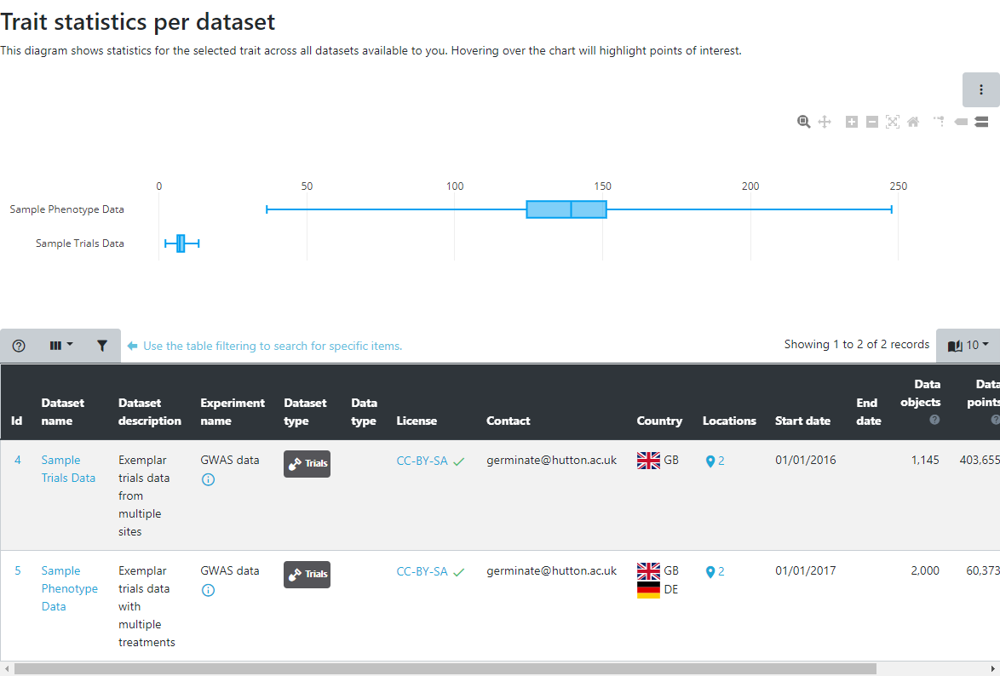

## Trial data export

Comparing trials in different locations or across years as well as comparing traits to identify correlations and outliers can provide detailed insight into the data. The trials export page has a variety of visualization and query interfaces to explore trials data. Lets get started by selecting **Trials export** from the left hand side menu under **Data**.

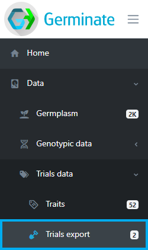

The table displayed shows the available trials datasets that are containes in Germinate. Select one or multiple trials from the datasets table to continue. Multiple datasets can be selected by clicking on the checkbox to the left hand side of the table. Once you have selected a dataset(s) click on **Next** to retrieve information on the selected dataset(s).

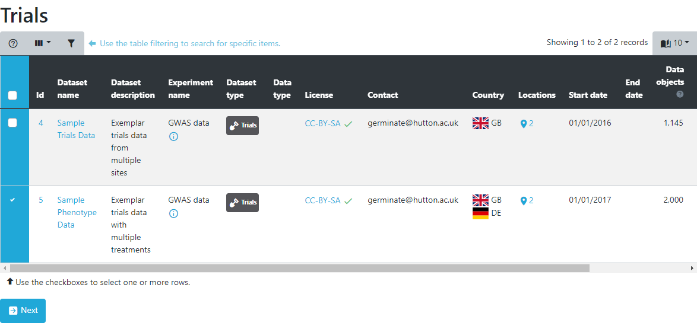

Trials information is broken down into differnt sections. Each one offers a different perspective onto the data and various ways of sub-selecting germplasm and traits as well as different colouring options.

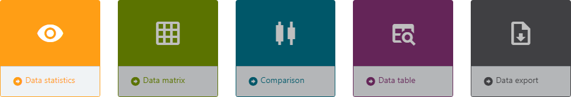

The overview statistics show overall characteristics of the data within the selected datasets. Select the traits you want to see and optionally some germplasm groups. The resulting chart shows a box plot per trait and dataset highlighting the spread within a trait as well as the differences between selected datasets. If the datasets are from different locations/sites or years, this chart is an ideal way to compare these scenarios.

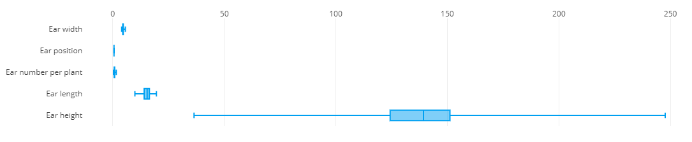

In the data matrix section, traits are plotted against each other to highlight patterns in the data like correlations and outliers. The traits that should be plotted are selected from the list. Optionally, a sub-selection of germplasm can be made to limit the visualization to only germplasm from these subsets. The resulting visualization is a matrix of scatter plots, each showing the combination of two traits. Each data point represents a germplasm scored for those two traits within the trial. Data can be coloured by things like treatment, recording date, or marked germplasm to further highlight the differences in the data.

> Remember all the charts are interactive so hover your mouse over chart elements to get additional information.

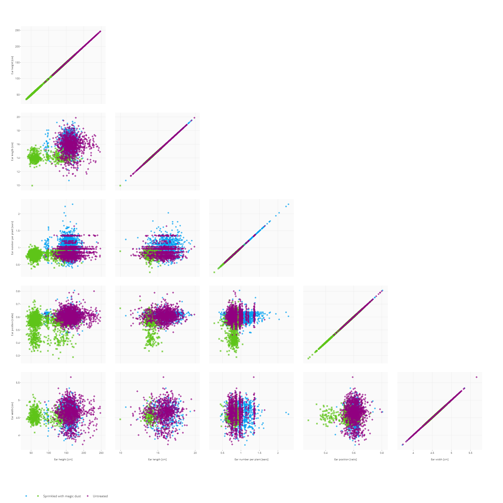

If only two traits are selected, a more detailed scatter plot is displayed showing data distributions along both axes. The contour density estimate can be toggled on and off by clicking ont he **Toggle contour** button. 

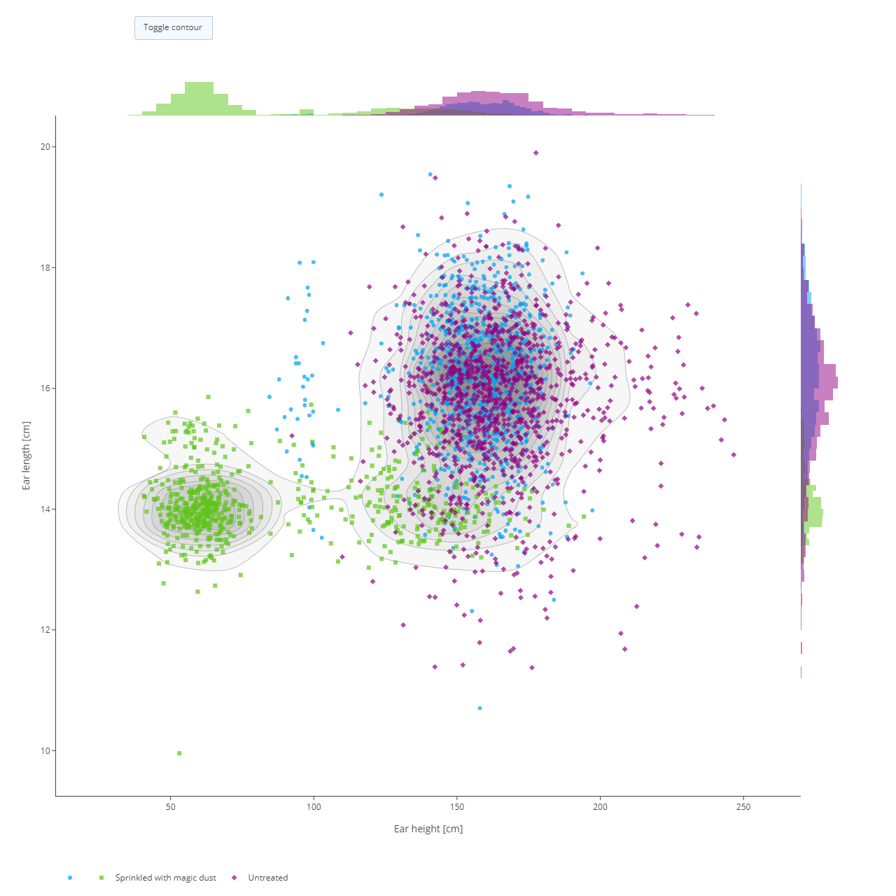

The comparison section will plot a small subset of germplasm side by side for a selection of traits to emphasize the germplasm performance compared to others. It will show a box plot of all values of a single germplasm compared to boxplots of the other germplasm. We have covered how to interpret box plots in other sections but if you need a recap then please have a look at [this link](https://en.wikipedia.org/wiki/Box_plot).

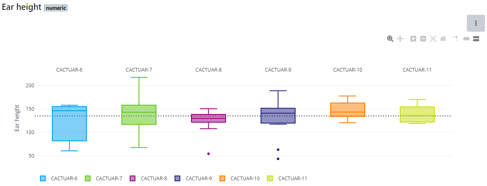

The data table presents a different perspective onto the data and offers all the table filtering and sorting functionalities already seen in previous tutorials. Searching for the data of a specific germplasm or finding germplasm within a yield range or above a certain height are easily achieved using the table filtering options (shown in green here at the top left of the table). In this example we have limited the data to the trait **Ear height** where the trait value is **greater than 70**. Filtering conditions can be found at the top of the data table. We can also see that there are **294** records that match these filtering criteria.

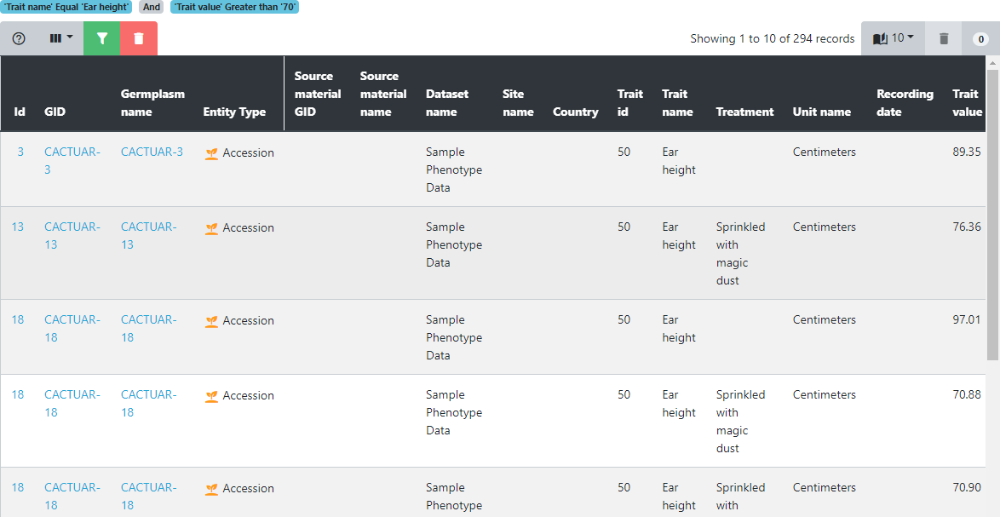

The final tab is where data can be downloaded in tab-delimited format. This format allows easy import into tools like Flapjack, Excel, and R. Combining this phenotypic data with the genotypic data in Flapjack.

## Tasks

1. 

Looking at the traits page, how many traits are in this Germinate database?
Answer: There are 51 traits defined in the database.

2. 

Sorting by the data points column, which trait has the most data points and how many?
Answer: The trait 'ear height' has 45,224 data points across 2 datasets.

3. 

Select trait 'Colour of leaf' (categorical data that uses hex colour values to show leaf colour), which value appears most often?
Answer: #27ae60. Note how there are 2 datasets each represented by a diffent colour in the histogram. 

4. 

Navigate to the trials export page and select the first dataset (it has an id of 4). Using the overview statistics, which plant line has the highest median value for the trait '1000 spine weight'?
Answer: To get this we can select the 'Comparison; option then the trait '1000 Spine Weight [Kg]' now hover over the box plot to see which has the highest median value. The answer is 'CACTUAR-10' with a value of '46.765'.

>Have an experiment with the phenotypic export options in Germinate and try each of the visualizations that it offers. Having an explore of some datasets that you are familiar with is a good way to get up to speed with using the Germinate tools.

