<!-- Use these horrible HTML tag attributes because Markdown only supports limited HTML/CSS -->

  

## Plant genomes: from data to discovery EBI Virtual Course

# Session 4: Geographic Data and Searching
 

# Searching for data

### Go to [https://germinate.hutton.ac.uk/demo](https://germinate.hutton.ac.uk/demo) to follow along with this material.

If you ever find yourself searching for a germplasm, a marker, a trait, or a location but you don't know the exact name, then the Germinate-wide search is where you'll find it. Simply type in a name-fragment into the search box at the top of the page and hit enter. Alternatively, first navigate to the search page using the main menu.

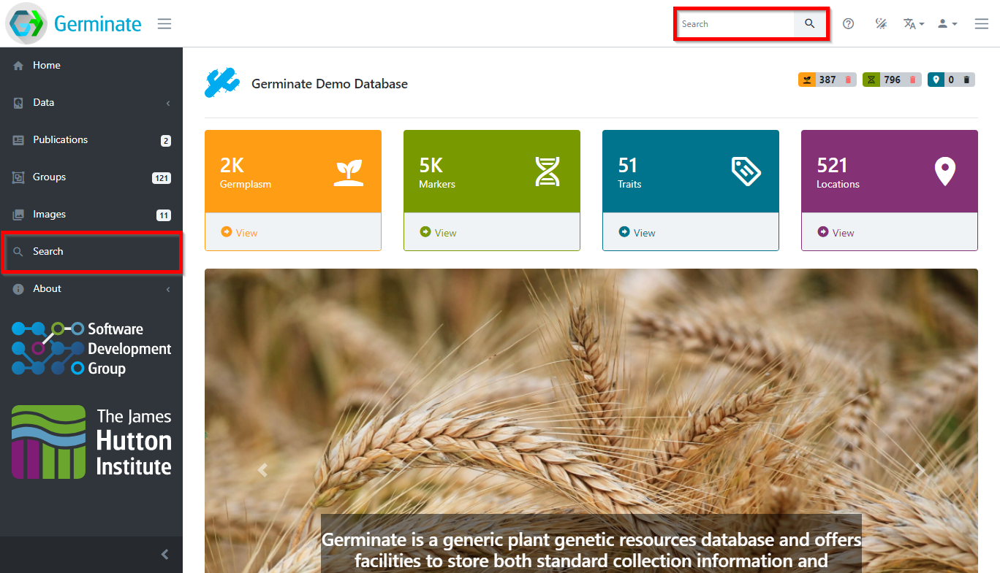

The search page will open and let you define what you're looking for. You can either search all data types or for any type individually. A click on the button starts the search and the results will be grouped into data type specific tables. So, if you're searching for a location name, you will see germplasm collected at this location as well as trials conducted at a location. Searching for a germplasm identifier will show the germplasm passport data as well as all trials and compound data recorded for this germplasm.

Let's look at some examples. Searching for `mexico` will return germplasm collected in Mexico as well as location information from Mexico.

> Important: Germinate will automatically include wildcards at the beginning and end of search strings if you select the **Contains** option. If you need to use a wildcard you only need to use it when it is contained **within** a search term. So for example you don't need to use '%ken%' but 'k%n' is valid. When using the **Contains** search option Germinate will automatically add % to the beginning and end of a search term.

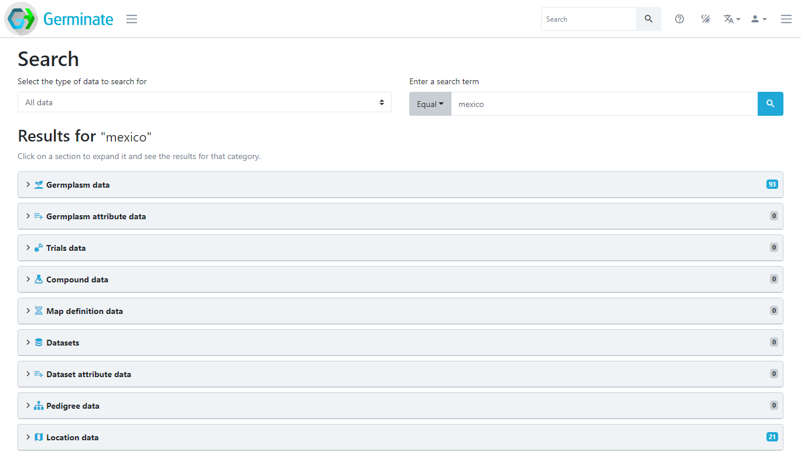 

Searching for a germplasm name returns all information related to this germplasm. In this case, there is passport data, trials data, compound data and pedigree data.

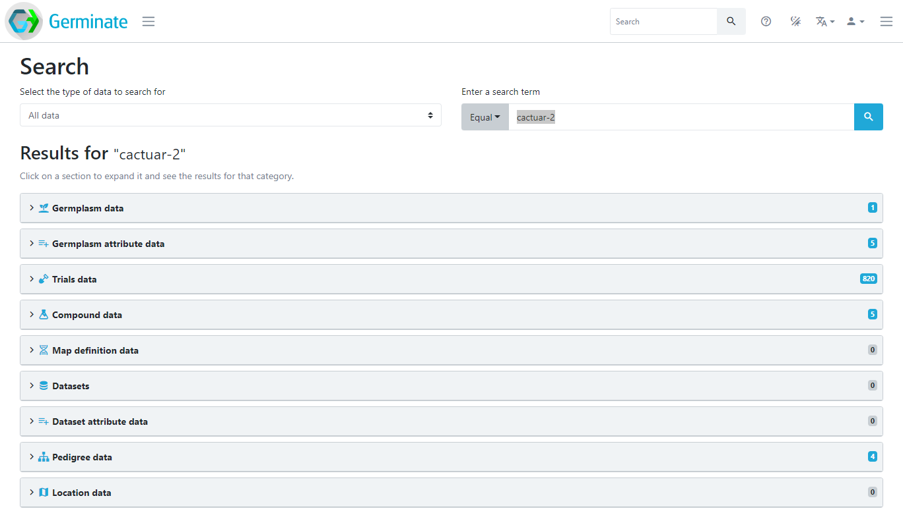 

Clicking on any of the result sections will expand it and show all search results for the selected data type. If we click on the "**Trials data**" section, we can see all the trials data points relating to germplasm `CACTUAR-2`.

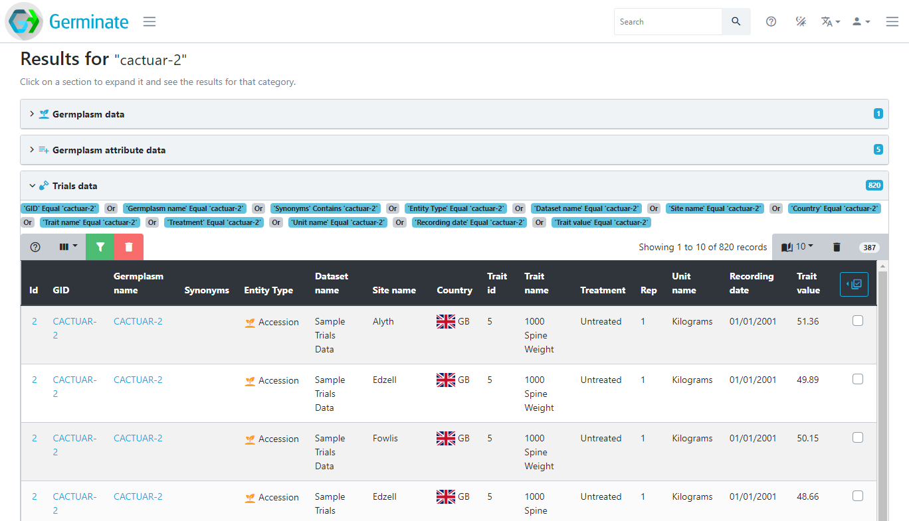 

You don't have to search for the name of something, the search term can be anything. For example, searching for a specific treatment will return data points from trials with that treatment, searching for `wild` will return everything that contains the term `wild` as seen below.

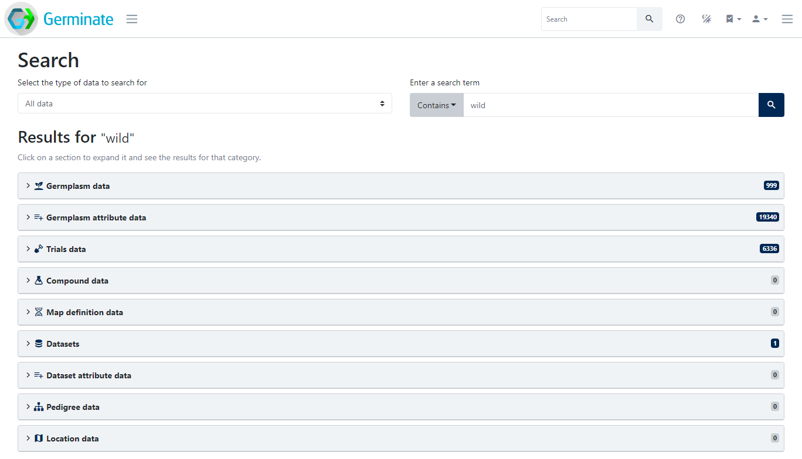 

Note that you may have to switch the comparison operator from `Equal` to `Contains` or even `Between` to fulfil your search needs.

## Tasks

1. 

Try searching using some terms. For example try searching for Kenya - how many germplasm entries were collected in Kenya? 
Answer: There are 8 plant lines that are located in Kenya.

2. 

We mentioned wildcards earlier. Wildcards can be used to search where you are unsure of something. Instead of entering 'Kenya' into the search try 'ken' and have a look to see why the data returned is different. Now try 'k%n' and again try and work out why the results returned are different. make sure you select the 'Contains' search option when you are doing this.
Answer: 'Kenya' will only return matches that contain the word 'Kenya' in it. 'ken' gets expanded to '%ken%' which is for anything that contains those characters which also includes a site in Uzbekistan. 'k%n' is anything that has a 'k' then something then an 'n' which is much more common and includes a wide variety of different matches in Germinate.

3. 

What germplasm exists in a location called 'Nairobi'?
Answer: There are 4 lines that are assigned to a location called 'Nairobi'. To do this just enter the search term then choose the 'Location data' results tab.

 

# Geographic data

Germinate contains a few tools to work with geographic data. These can be found from the Germinate left hand side menu by selecting **Geographic data** The two options we have are to view **Locations** or do a **Geographic search**. To get started lets choose the **Locations** menu item and we can see the locations that we have stored in Germinate.

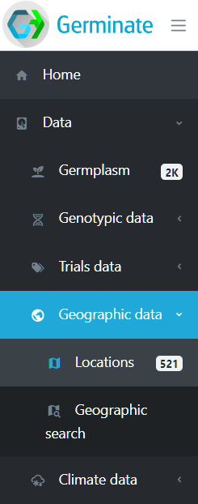

We can see from the menu that this version of Germinate contains 521 locations. Locations are either where a piece of germplasm has been collected or where a trial site is located. Click on **Locations** and we will look at them in greater detail. We can see below the information that is held in Germinate for locations. The **Type** column shows the type of location - in this case we only have collecting sites. Clicking on the location **Site name** will take you to a page with all germplasm assigned to that location. As with all Germinate tables clicking on table headers will toggle sort - then reverse sort. Filtering options are also available on the locations table.

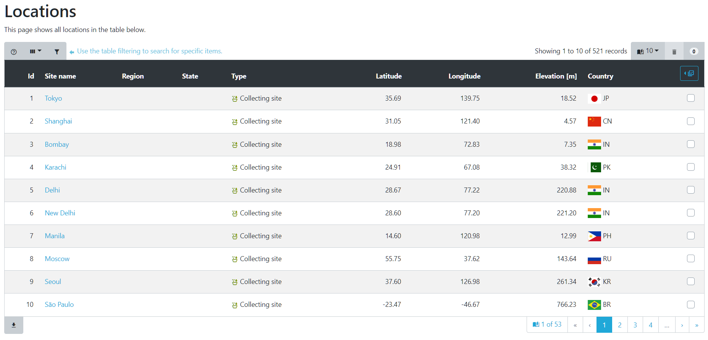 

In addition to lists of locations, Germinate also shows the position of locations on a map based visualization. Germinate provides two of these. The first (clustered) seen below shows numbers of germplasm within an area. As you zoom into the map the location numbers will change as you see finer scale detail. 

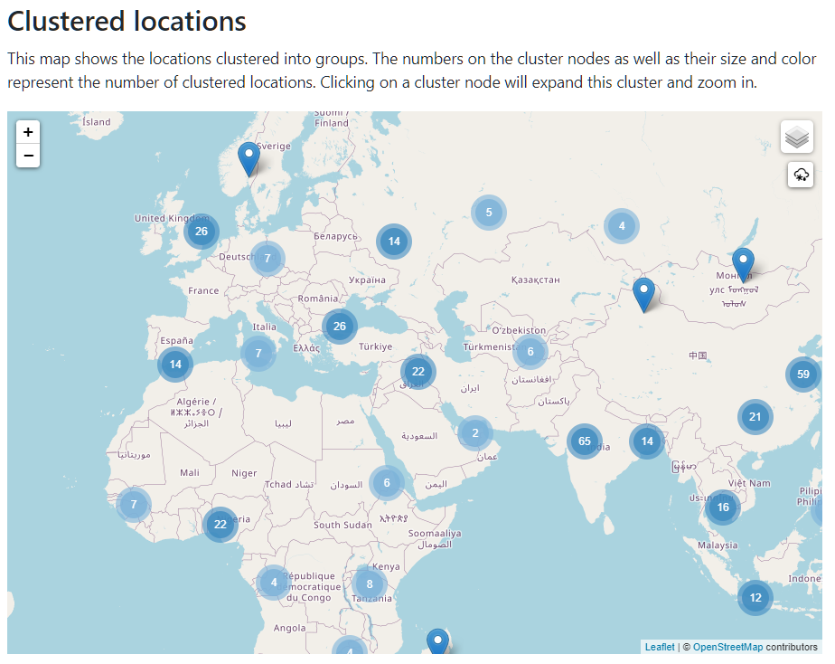 

The second representaion (heatmapped) shows a density map where the darker the colour the larger the number of locations that are within that area. Again you can zoom to see more detail within a region.

These sorts of representations give a good indicataion of the distribution of collection sites and trials held within Germinate.

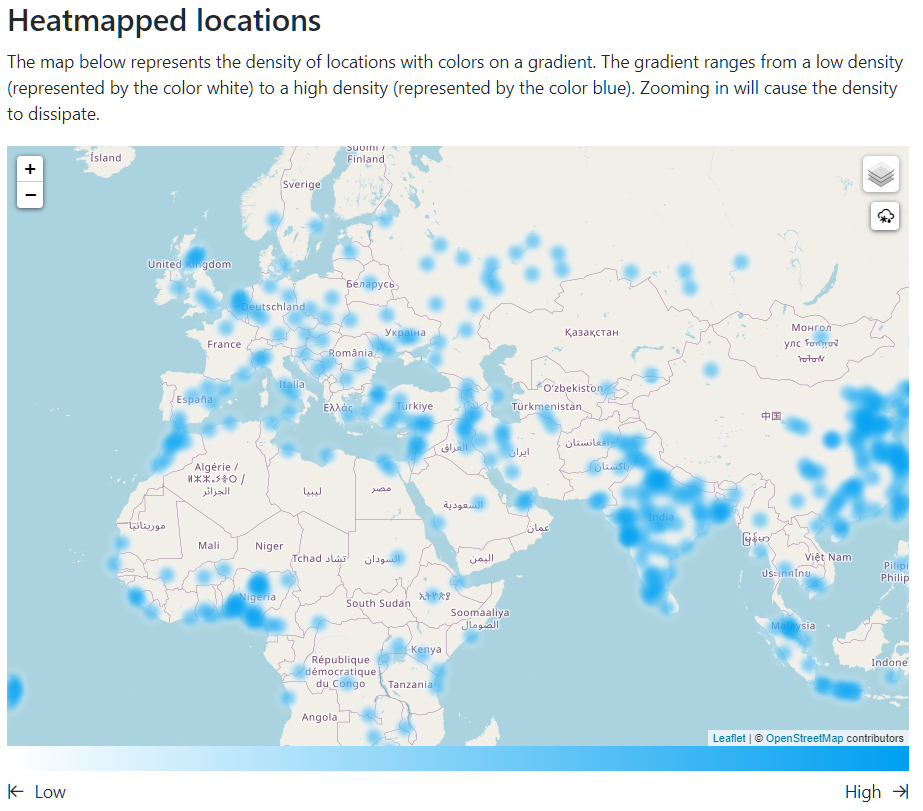 

So seeing where locations are is all well and good but what practical use do we have for these Germinate features? 

If we go back to our left hand Germinate menu then under **Data** -> **Geographic data** -> **Geographic Search** we will see the following interface. Make sure the **Point Search** option is selected at the top of the map. 

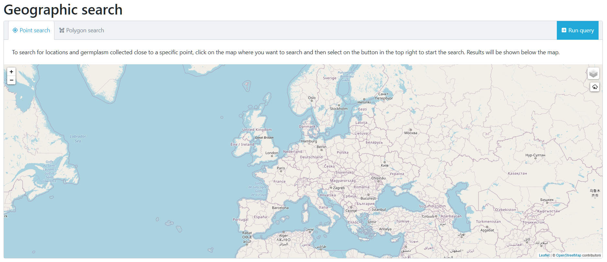

Now use your mouse to select a point on the map. In this case we have choosen somewhere near to us in Scotland. 

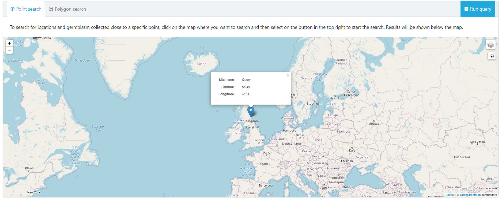 

Now click on the **Run query** button that is at the top right hand side of the map. This will go and look for locations which are close to our selected point.

You will see that after selecting **Run query** that we now have 2 data tabs which have appeared. **Locations ordered by distance** and **Germplasm ordered by distance**. These two tabs can be selected to reveal either a list of locations or germplasm ordered by the distance they are from the point we selected.

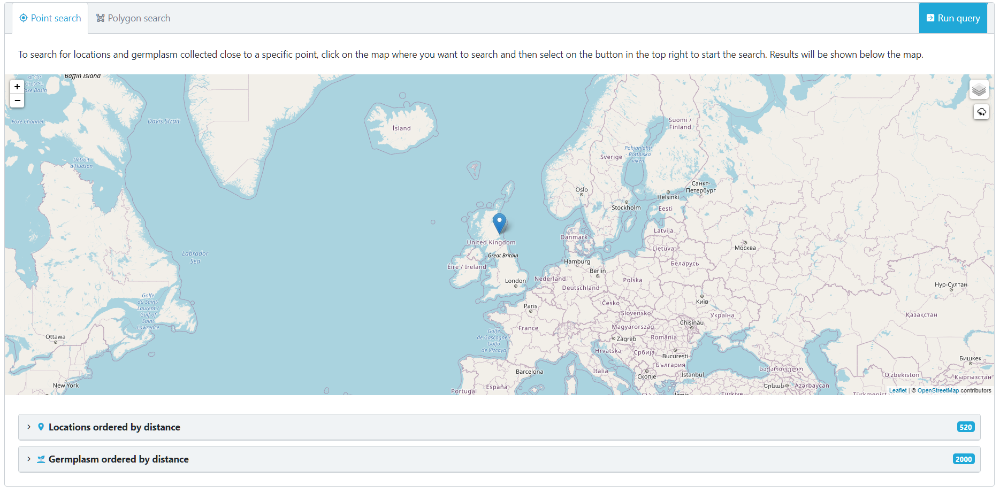 

 Click on the **Locations ordered by distance** tab.

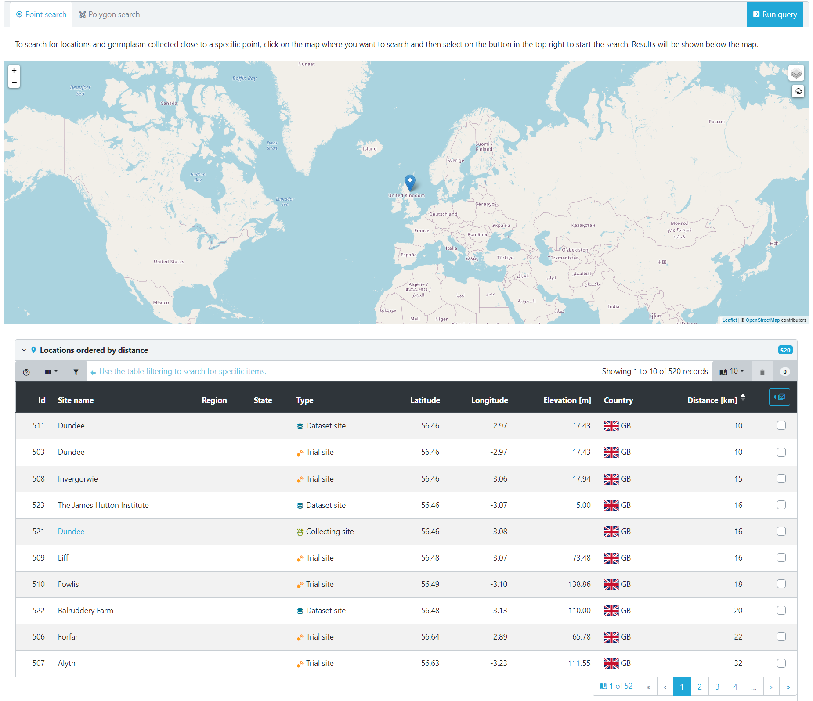 

This table then shows locations. You can see that we were pretty accurate with placing our tab and were only 16Km from the James Hutton Institute site in Scotland. Again this is a Germinate table so both sortable by clicking table headers of filterable by using table options. This table shows us that we have a number of different types of locations close to our pin - **Dataset site**, **Trial site** and **Collecting site** types. 

But what if we want to choose our own geographic region by drawing a bounding area? We can do that too. You need to select the **Polygon search** option from the top left of the map then use your mouse to select points on the map. Once you close an area by clicking on the first point a polygon will be defined.

Now cilck on **Run query** like before and Germinate will go and find all locations within the polygon that we defined.

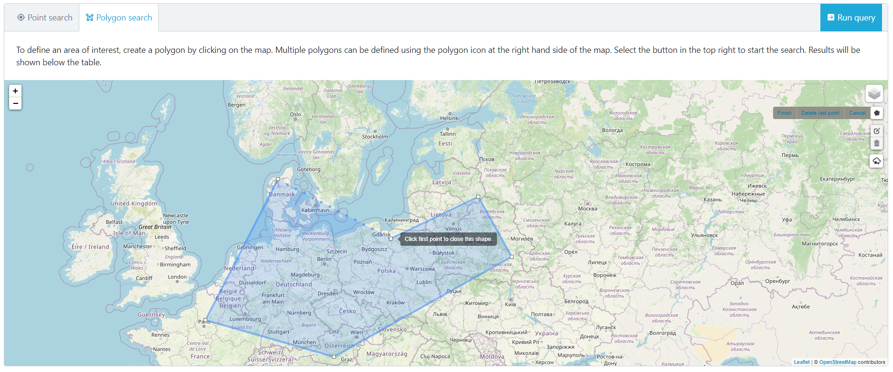 

Locations will be shown that are within the polygon that we just defined. 

Clicking on a **Site name** will take you to everything within that location.

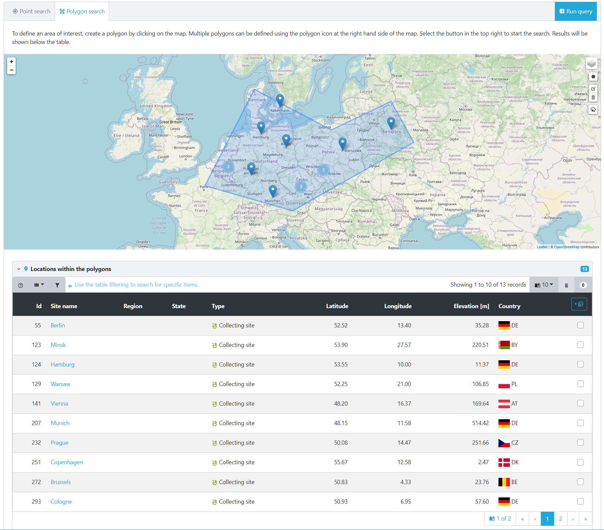 

Cilcking on a location will give you additional information about the location. In this case its a German location. 

> Remember you can zoom in an out of the map as well as pan it by clicking with your mouse.

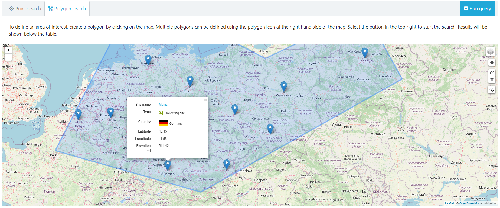 

But what can we do now we can accurately select locations within Germinate? Well one option would be to create a group of locations which can then be used to export data. To do that we can select the locations we are interested in from the table then select the table options which are highlighted here. Now choose **Create group**. We will cover creating and editing groups in another tutorial but it's worth remembering why we might want to use the geographic functions within Germinate.

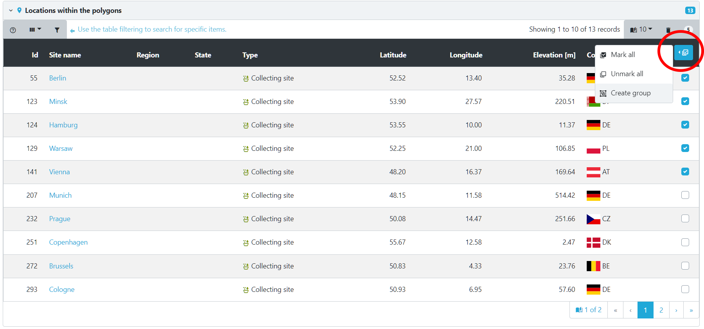 

## Tasks

1. 

Geography lesson - how many locations are in the United Kingdom?
Answer: There are 15 locations within the UK.

2. 

What is the closet location to Lisbon in Portugal? What is the furthest away plant line to Lisbon?
Answer: Sevilla in Spain (~314Km depending on where you dropped the pin) and there are a few plant lines that have locations in Sydney, Australia (around 18,000Km away). If you did not get this remember you need to cilck on the 'Distance [Km]' table column to sort (and maybe again to toggle).

## Thanks for taking the time to complete this traning. We hope that this will allow you to have more confidence in using Germinate, know a bit more about what it does and provide you with foundations on which you can go on to explore it further, perhaps with your own datasets! 

## For additional information on germinate you can visit https://germinate.hutton.ac.uk, drop us an email germinate@hutton.ac.uk or reach out to us on X @germinatehub.